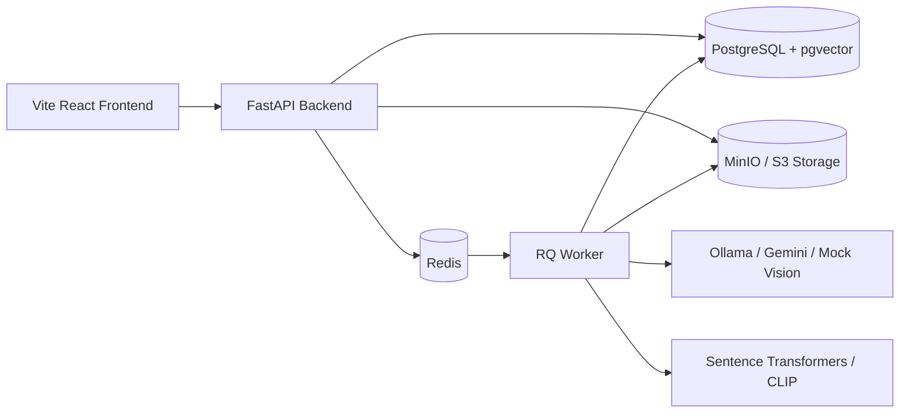

<p align="center">
  <strong>Sorty</strong>
</p>

<p align="center">
  AI-assisted event photo sorting, review, search, publishing, and ZIP export.
</p>

<p align="center">
  <a href="https://sortyy.vercel.app">Live Frontend</a>
  |
  <a href="docs/ARCHITECTURE.md">Architecture</a>
</p>

<p align="center">
  
  
  
  
  
</p>

---

## Overview

Sorty is a media operations app for event teams.

Upload a batch of event photos, let the worker pipeline analyze and organize them, review the uncertain ones, search the final gallery, publish a public event page, and export a clean ZIP package with metadata.


## What Sorty Does

- Upload event photos in batches
- Generate thumbnails
- Detect blurry images
- Flag likely duplicates
- Run AI vision analysis for captions, tags, folders, and review reasons
- Pause for human review when an image needs a decision
- Resume processing after review
- Search media with text embeddings and optional CLIP visual search
- Publish public event galleries
- Export approved media as an organized ZIP

## Product Flow

```text
Create Event
    |
Upload Photos
    |
Worker Pipeline
    |
Quality + Vision + Embeddings
    |
Needs Review? ---- yes ----> Review Queue ----> Resume Pipeline
    | no
    v
Approved Media
    |
Search / Publish / Export ZIP
```

## Architecture



## Tech Stack

| Layer | Tools |
| --- | --- |
| Frontend | React, TypeScript, Vite, React Router, TanStack Query, Tailwind CSS |
| Backend | FastAPI, SQLAlchemy, Alembic, Pydantic |
| Worker | Redis Queue, worker tasks, checkpointed review flow |
| Database | PostgreSQL, pgvector |
| Storage | MinIO locally, S3-compatible storage in production |
| AI | Ollama, Gemini, mock provider, sentence-transformers, CLIP |

## Repository

```text
.
|-- backend/        # FastAPI app, services, schemas, tests
|-- worker/         # Background media processing worker
|-- frontend/       # Vite React application
|-- alembic/        # Database migrations
|-- docs/           # Project documentation
|-- scripts/        # Local helper scripts
`-- docker-compose.yml
```

## Quick Start

### Prerequisites

- Docker Desktop
- Node.js 20+
- Python 3.11+ for local test runs

### Start the Backend Stack

```bash
docker compose up --build
```

Apply migrations:

```bash
docker compose run --rm backend alembic upgrade head
```

Check readiness:

```bash
curl http://localhost:8000/api/ready
```

API docs:

```text
http://localhost:8000/docs
```

### Start the Frontend

```bash
cd frontend
npm install
npm run dev
```

Open:

```text
http://localhost:5173/landing
```

For the local admin unlock token, use the `ADMIN_TOKEN` value in `.env.example`.

## Frontend Deployment

The frontend is ready for Vercel.

Use these settings:

| Setting | Value |
| --- | --- |
| Framework | Vite |
| Root Directory | `frontend` |
| Build Command | `npm run build` |
| Output Directory | `dist` |
| Install Command | `npm install` |

`frontend/vercel.json` redirects `/` to `/landing` and supports SPA routes.

For frontend-only hosting, no environment variables are required.

When the backend is hosted, add:

```text
VITE_API_BASE_URL=https://your-backend-domain.com/api
```

## Backend Deployment

The backend is meant for a Docker-friendly host, not a serverless-only frontend host.

Recommended split:

- Frontend: Vercel
- Backend API: Render, Railway, Fly.io, DigitalOcean, AWS, GCP, or a VPS
- Worker: separate background worker service
- Database: PostgreSQL with pgvector
- Queue: Redis
- Storage: S3-compatible object storage
- Vision provider: Gemini for hosted demos, or Ollama on a machine you control

For hosted backend deployments, set a real admin token in backend environment variables. Do not put backend secrets in `VITE_*` variables.

## Useful Commands

Backend tests:

```bash
python -m pytest backend/app/tests
```

Frontend build:

```bash
cd frontend
npm run build
```

Run migrations:

```bash
docker compose run --rm backend alembic upgrade head
```

Backfill CLIP visual embeddings:

```bash
docker compose run --rm backend python -m app.services.visual_backfill_service
```

## API Surface

| Area | Path |
| --- | --- |
| Health | `/api/health`, `/api/ready` |
| Events | `/api/events/...` |
| Uploads and media | `/api/events/{event_id}/media/...`, `/api/media/...` |
| Review | `/api/events/{event_id}/review`, `/api/media/{media_id}/review` |
| Jobs | `/api/jobs/...` |
| Search | `/api/events/{event_id}/search` |
| Export | `/api/events/{event_id}/export`, `/api/exports/...` |
| Public gallery | `/api/public/events/{public_slug}` |

## Roadmap

- Hosted backend deployment profile
- Better public gallery presentation
- Stronger visual search ranking controls
- Export templates
- Cleaner media status observability
- Optional hosted AI provider preset for demos

